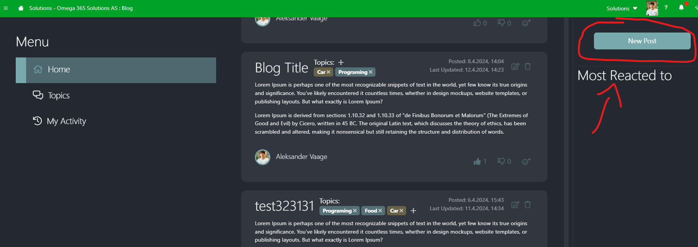
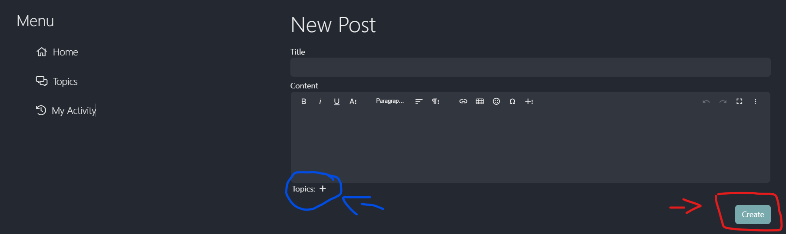
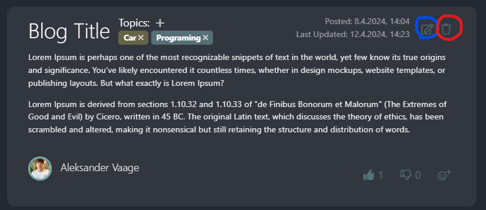
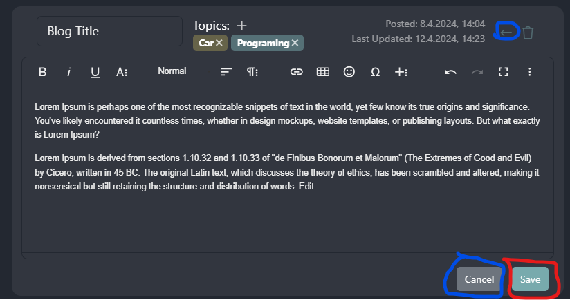
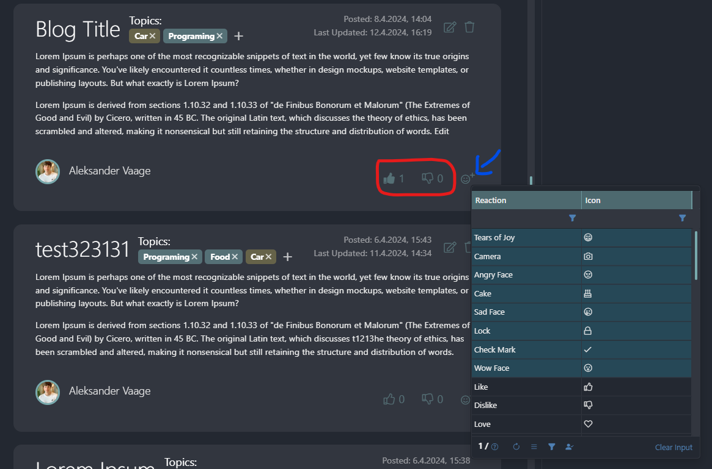
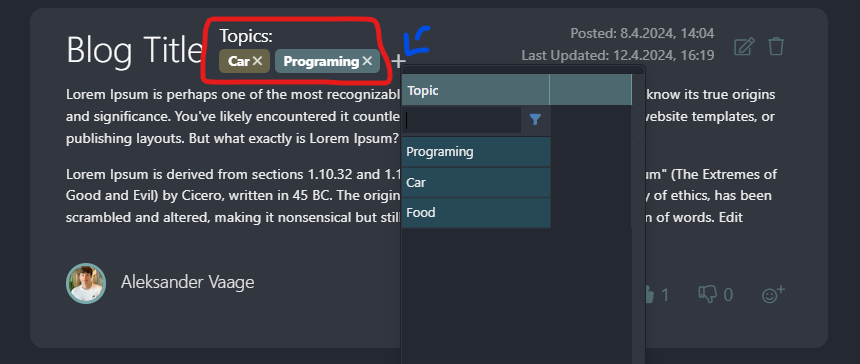
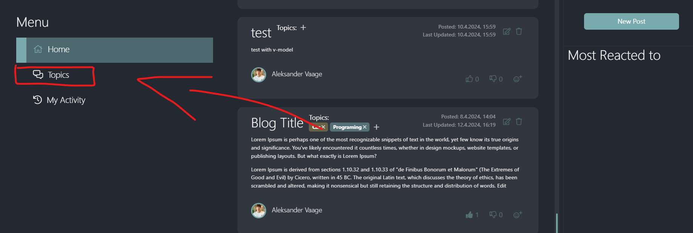
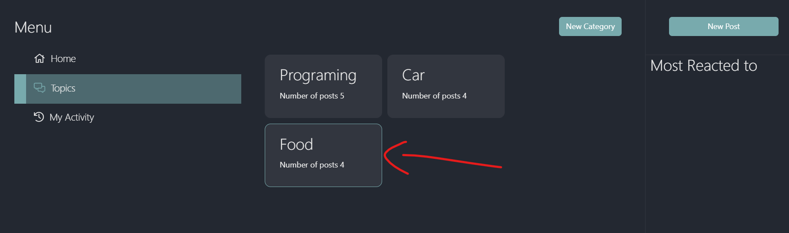
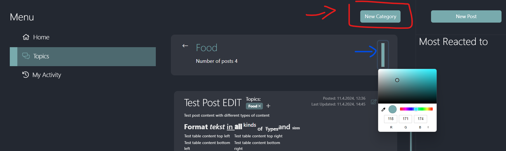

<h1>Brukerveiledning</h1>

  

    <h2>Lage ett nytt inlegg</h2>
  

  Fra fremsiden, trykk på New Post knappen oppe til høyre.
  
  Herfra skriver du inn tittel på posten og formaterer innholdet slik du ønsker det. 
  Du kan legge til topics ved å trykke på plussen bak topics teksten under content editoren. 
  Når du er klar til å poste trykker du på Create knappen.
  

  

    <h2>Redigering / sletting av poster</h2>
  

  Om du vil redigere et innlegg kan du gjøre det med edit / delete icone øverst til høyre i innlegget. Disse viser bare om du er forfatter av innlegget. 
   
  Endringene lagres med lagre knappen eller kanseleres med cancel knappen eller tilbake ikonet  
   

  

    <h2>Reagere</h2>
  

  Du kan reagere på inlegg nede til høyre på innleggene
  

  

    <h2>Legge til topics</h2>
  

  Topics kan legge til i toppen ved siden av tittelen.
  

  

    <h2>Sortere på topics</h2>
  

  For å sorte posts på topics åpne topics fanen fra fremsiden.
  
  Herfra trykker du på ønsket topic for å se de forskjellige
  

  

    <h2>Lage ny topic og ednre farge</h2>
  

  For å lage ny topic trykk oppe i høyre på topics fanen. 
  Velg farge til høyre av topics boksen etter å ha valgt topic.
  

