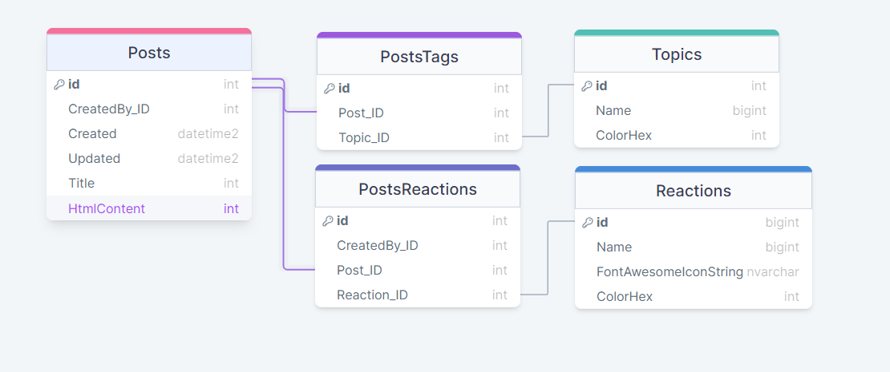

# Fagprøve Blogg 2024
## Målsetning 
I denne fagprøven skal jeg lage en blogg applikasjon som er beskrevet i oppgave bestillingen. Målet er å presentere meg som en dyktig fagarbeider og demonstrere mine ferdigheter samtidig som jeg dekker alle de nødvendige punktene. 

Oppgavebeskrivelsen beskriver en blogg applikasjon med en database og en klient som skal snakke sammen. Det skal være gjennomgående høyt fokus på sikkerhet i hele applikasjonen og ha en strukturert tilgangsstyring. Blogg-eieren skal kunne poste, redigere og slette blogg innlegg. Eieren skal også kunne formatere blogg-innlegget. Brukere/besøkende skal kunne reagere på posten i form av f.eks tommel opp eller ned. 

## Fremgangsmåte / Arbeidsoppgaver 

- Først skal jeg starte med å tenke ut og illustrere en database modell i illustrerings-applikasjonen Draw-SQL. 

- Etter jeg har definert tabellene vil jeg tenke ut hvilke views og procedures jeg vil trenge. 

- Når jeg har et klart bilde av hvordan backenden blir, vil jeg illustrere en enkel skisse av hvordan brukergrensesnittet kommer til å se ut i Figma. 

- Etter dette vil jeg starte med å opprette tabeller og triggere basert på modellen. 

- Så vil jeg lage nødvendige procedures og views. Og sjekke at de flytter og viser rett data til de rette brukerene. 

- Etter att backenden er lagd vil jeg gå igang med designet, basert på Figma-skissen. 

- Når frontenden også er ferdig, vil jeg gjøre store mengder testing og gå gjennom dokumentasjonen jeg har skrevet underveis og sjekke at den er tilstrekkelig. 

- Planlegge og forberede meg til fremvisningen

## Nødvendige Ressurser / Utstyr

Jeg kommer til å bruke Appframe rammeverket til omega 365 til det ytterste. Dette løser mange problemer rundt innlogging og registrerings kravene. I tillegg legger det opp til enkel tillgangstyring og gode sikkerhetsrutiner med moduler, roller og capabilities. Appframe er designet for å integreres sømløst med SQL, noe som gjør det til et naturlig valg for meg. Jeg har valgt å benytte NT(New Tech) versjonen av Appframe, den gir blandt annet tilgang til en betydelig forbedret grid sammenlignet med CT (Current Tech) versjonen. NT-versjonen bruker Vue.js, noe som åpner opp flere muligheter innen utviklingen. Dette er også det rammeverket jeg har mest erfaring med, noe som gjør det til et naturlig valg for prosjektet. 

## Tidsforbruk/Tidsskjema/ Kostnadsoverslag 

- Fredag 05.04 (Endret datoen)
    - Gjennomgang fagprøve - 1.5t
    - Planlegge og skrive planleggingsdokument - 3.0t
    - Deffinere database modell og lage diagram - 1.0t
    - Tenke ut hvilke views og procedures som trengs - 1.0t
    - Designe en skisse i Figma - 1.0t
    - Leveredokument med skisser og diagram - Før 17:00

- Lørdag 06.04
    - Lage tabeller, views og procedures - 7.5t

- Søndag 07.04
    - Fullføre views og procedures - 7.5t

- Mandag 08.04
    - Starte utvikling på frontenden - 7.5t

- Tirsdag 09.04
    - Legge tilrette for eventuelle endringer og implimentere de 7.5t
       
- Onsdag 10.04
    - fullføre det meste av utviklingen på frontenden - 4t
    - Teste applikasjonen 3.5t

- Torsdag 11.04
    - Utbedre feil funnet under utviklingen - 3.5t
    - Skrive systemdokumentasjon, testrapport og brukerveiledning 4t

- Fredag 12.04 (Endret datoen)
  - Skrive systemdokumentasjon, testrapport og brukerveiledning 7.5t
  - Levere dokumentasjon før frist 17:00 !!
- Lørdag 13.04 (Helg lagt til)
    - Diverese forberedelser til presentasjon 7.5t

- Søndag 14.04 (Helg lagt til)
    - Diverse forberedelser til presentasjon 7.5t

- Mandag 15.04
    - Vise frem løsning
 
## Informasjonskilder og Samarbeidspartnere 
Jeg bruker andre kollegaer, faglig leder Tor Halvorsen Aasheim og tilgjengelig informasjon på nettet for å innhente nødvendig informasjon under fagprøven.

## Skisse løsning
### Database Diagram

Første utkast av tabell oppsettet.
- Posts
    - Inneholder blog postene.
- PostsTopicss
    - Samling av topics lagt til på posts.
- Topics
    - De forskjellige topicene som kan legges på blog postene.
- PostsReactions
    - Samling av reaksjoner lagt til på posts.
- Reactions
    - De forskjellige reaksjonene som kan legges til på blog på postene

### Mulige utbedringer til senere
Om jeg ser jeg får tid vil jeg legge til komentar funksjonalitet

