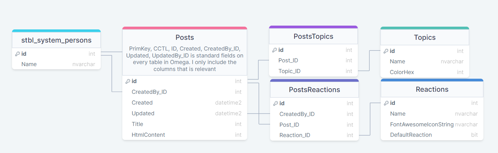

<div align="center">
  <h3 align="center">System Dokumentasjon</h3>
  <p align="center">
    <b>Fagprøve - Blogg</b>
    <br />
    <sub>05.04.24 - 15.04.24</sub>
  </p>
</div>
<details open>
  <summary>
    <h2>Info</h2>
  </summary>
    
  Fagprøve oppgave.
  
  Målet var å lage en blogg-app der brukere kan publisere og administrere sine egne blogginnlegg. Blogginleggene skal ha enkel formatering og det skal være en mulighet for brukere å reagere på postene i form av kudos/likes/reactions. I tillegg ble det lagt til muligheten for brukere å knytte blogginnlegg til forskjellige topics. Det er mulig å opprette nye, slette og endre farge på topicene. Det er også mulig å sortere etter spesifikke topics. For eksempel, hvis du bare vil se blogginnlegg om mat eller programmering, kan du enkelt sortere etter dette i topics-fanen.
Krav for oppgave
- Applikasjonskomponenter
  - En server- og en klient-komponent, bloggposter med metadata ligger på server og tilbyr disse via et sikret API. 
- Innleggshåndtering
  - Legg til nye blogginnlegg med dato, vis en liste over tidligere innlegg, og gi muligheten til å slette og editere spesifikke innlegg. 
- Lagring
  - Innlegg med metadata lagres på server, med en sikring for at kun eieren av bloggen kan redigere innholdet. 
- Design
  - Design som møter grunnleggende krav til universell utforming og tilgjengelighet. 

Bruksanvisning finner du her: [Brukerveiledning](https://github.com/alVaage/fagprove-blogg/Brukerveiledning.md)

<hr>
</details>
<details open>
  <summary>
    <h2>Teknologier</h2>
  </summary>
    
- Appframe 365 (NT)
    - Omega sitt eget rammeverk
    - Håndterer innlogging på en sikker måte
    - Legger opp til gode sikkerhetsrutiner med roller, moduler og capabilities
- Vue.js sammen med Bootstrap
    - Frontenden lages med vue.js og bootstrap
    - Dette gir mange muligheter og legger opp til enkel og effektiv utvikling
- Font Awsome ikoner
  - Ikoner hentes enkelt fra Font Awsome
  - Enormt mye mer innholdsrik en ikonene som kommer med bootstrap
- SQL database
  - Appframe er designet for å brukes med sql
  - Naturlig valg for å håndtere data
<hr>
</details>

<details open>
  <summary>
    <h2>Arkitektur</h2>
  </summary>
  
  <ul>
    <li>
      <summary>
        <h4>Tabeller</h4>:
      </summary>
      
      <table>
        <tr>
          <th>Tabell Navn</th>
          <th>Beskrivelse</th>
          <th>Modul - Blog Viewer tilganger</th>
          <th>Modul - Blog Viewer tilganger</th>
          <th>Insert trigger</th>
          <th>Update trigger</th>
          <th>Delete trigger</th>
          <th>Foreign Key</th>
          <th>Unique Constraints</th>
        </tr>
        <tr>
          <td><b>atbl_AVBlog_Posts</b></td>
          <td>
            Inneholder innlegets innhold og metadata
          </td>
          <td>
            Kan se
          </td>
          <td>
            Kan se, legge til, redigere og slette
          </td>
          <td>
            Sikkerhetssjekk
          </td>
          <td>
            Sikkerhetssjekk
          </td>
          <td>
            Sikkerhetssjekk
          </td>
          <td></td>
          <td></td>
        </tr>
        <tr>
          <td><b>atbl_AVBlog_PostsTopics</td>
          <td>
            Kobler topics til posts
          </td>
          <td>
            Kan se
          </td>
          <td>
            Kan se, legge til, redigere og slette
          </td>
          <td>
            Sikkerhetssjekk
          </td>
          <td>
            Sikkerhetssjekk
          </td>
          <td>
            Sikkerhetssjekk
          </td>
          <td>Post_ID => ID (atbl_AVBlog_Posts), <br>
            Topic_ID => ID (atbl_AVBlog_Topics)
          </td>
          <td>(Topic_ID, Post_ID)</td>
        </tr>
        <tr>
          <td><b>atbl_AVBlog_Topics</td>
          <td>
            Inneholder de forskjellige topic-ene
          </td>
          <td>
            Kan se
          </td>
          <td>
            Kan se, legge til, redigere og slette
          </td>
          <td>
            Sikkerhetssjekk
          </td>
          <td>
            Sikkerhetssjekk
          </td>
          <td>
            Sikkerhetssjekk
          </td>
          <td></td>
          <td>(Name)</td>
        </tr>
        <tr>
          <td><b>atbl_AVBlog_PostsReactions</td>
          <td>
            Kobler topics til posts
          </td>
          <td>
            Kan se, legge til, redigere og slette
          </td>
          <td>
            Kan se, legge til, redigere og slette
          </td>
          <td>
            Sikkerhetssjekk og fjerner gamle reaksjoner om du allerede har reagert på innlegget
          </td>
          <td>
            Sikkerhetssjekk
          </td>
          <td>
            Sikkerhetssjekk
          </td>
          <td>Post_ID => ID (atbl_AVBlog_Posts), <br>
            Reactions_ID => ID (atbl_AVBlog_Reactions)
          </td>
          <td></td>
        </tr>     
        <tr>
          <td><b>atbl_AVBlog_Reactions</td>
          <td>
            Inneholder de forskjellige reacksjonene
          </td>
          <td>
            Kan se
          </td>
          <td>
            Kan se, legge til, redigere og slette
          </td>
          <td>
            Sikkerhetssjekk, legger til SortOrder om reaksjonen er DefaultReaction
          </td>
          <td>
            Sikkerhetssjekk, legger til SortOrder om reaksjonen er DefaultReaction
          </td>
          <td>
            Sikkerhetssjekk
          </td>
          <td></td>
          <td>(Name), (FontAwsomeIconString)</td>
        </tr>   
      </table>
    </li>
    <!--<li>
      <details>
          [<summary>
            <h4>Views</h4>:
          </summary>
          <table>
          <tr>
            <th>View Navn</th>
            <th>Beskrivelse</th>
            <th>Kode</th>
          </tr>
          <tr>
            <td>aviw_ArvidWedtstein_MyShoppingLists</td>
            <td>
              View for å begrense hvem som ser hvilke handelister.<br>
              Dette viewet tar med seg prosent fullført, hvem listen har blitt delt med for å vise "Shared with" på fremsiden som JSON.<br>
              Legger også til alle som har fått tildelt handelisten i søkekolonnen.
            </td>
            <td>
             
            </td>
          </tr>
          <tr>
            <td>aviw_ArvidWedtstein_ShoppingListsItems</td>
            <td>
              Eksisterer for å få med de siste relevante kolonnene for Søke kolonnen, i tilleg til å få med bilde, navn og kategori på varen.<br>
              Brukes på siden for å vise handelistens innhold.
            </td>
            <td>
              
            </td>
          </tr>
          <tr>
            <td>aviw_ArvidWedtstein_ShoppingListsSharedWith</td>
            <td>
              Dette viewet eksisterer bare for å få med navn på hvem handelisten(e) er delt med.
            </td>
            <td>
             
            </td>
          </tr>
          <tr>
            <td>aviw_ArvidWedtstein_GoodsLkp</td>
            <td>
              Dette viewet eksisterer bare som datasource for lookupen til å legge til ny vare.<br>
              Viewet tar seg seg dine "personlige" varer so mdu har laget, samt de som eventuelt ble laget av noen i samme handleliste som du er en del av.</td>
            <td>
             
            </td>
          </tr>
        </table>
      </details>
    </li>-->
  </ul>
</details>
<details open>
  <summary>
    <h2>Sikkerhet</h2>
  </summary>
    I omega løses sikkerheten med moduler, roller og capabilities. <br> 
    Vi bruker moduler for å definere "tilgangs pakker" som sier hvilke tabeller du skal kunne lese data fra, slette og gjøre endringer på. Her setter du også opp hvilke apper du får se.<br>
    Modulene knyttes så til roller som videre knyttes på brukere. Rollene kan knyttes til mange moduler og capabilities. Og mange brukere kan knyttes til en bruker. Dette fører til veldig enkel og oversiktlig tilgangstyring.<br>
    Capabilities kan brukes til å gi spesial tilganger til roller der det ikke ønskes å opprette en ny modul.<br>
    For å få tilgangen til en bruker trenger du en login. Databasen i omega er satt til mixed login, noe som gjør at du kan både bruke sql brukernavn og passord, og microsoft authentication. <br>
    Begge innloggings metodene resulterer i at det returneres token som verifiserer at du er du.
</details>
<details open>
  <summary>
    <h2>Testing</h2>
  </summary>
    
  For å sikre kvalitet på appen(e), har jeg laget en [Testrapport](./TestReport.md) der jeg har gått over funksjonene i appen.
  
  <hr />
</details>
<details open>
  <summary>
    <h2>Grensesnittbeskrivelse</h2>
  </summary>

- For beskrivelse hvordan applikasjonen brukes se:
  [Brukerveiledning](./Brukerveiledning.md)

- Under finner du beskrivelse av funksjonaliteten sammen med litt kode:
    <table>
      <tr>
        <th>Funksjoner</th>
        <th width="500" colspan="2">
          Beskrivelse
        </th>
        <th>Kode</th>
        <th>Bilder</th>
      </tr>
      <tr>
        <td>Genere innhold</td>
        <td colspan="2">
        <p>
          Alt innholdet som baserer seg på data er generert med <b>v-for</b>.<br>
          Det er innebygd funksjonalitet i vue og lar deg loope gjennom en ett array eller dataobject og generere elementer ut i fra det. Hver rad blir ett element. Om du legger :key="ItemIndex" på elementet vil elementet også oppdateres om dataobjectet endres.
        </p>
        </td>
        <td>
          <table>
            <tr>
              <td>
                
              </td>
            </tr>
          </table>
        </td>
        <td>
          <table>
            <tr>
              <td>
                
              </td>
            </tr>
          </table>
        </td>
      </tr>
  <tr>
    <td>Side styring</td>
    <td colspan="2">
    <p>
      Side visningen er styrt av en ref variabel som settes til 'Home', 'New', 'Topic' osv. basert på hvilke side som skal vises.<br>
      Denne variabelen sendes mellom de forskjellige filene ved bruk av props og emits. Dette fører til enkel og god kontrol som sikrer at side menyen og innholdet alltid vil stemme overens, da disse baserer seg på samme variabel.          
    </p>
    </td>
    <td>
      <table>
        <tr>
          <td>
            
          </td>
        </tr>
      </table>
    </td>
    <td>
      <table>
        <tr>
          <td>
            
          </td>
        </tr>
      </table>
    </td>
  </tr>
  <tr>
    <td>Formatering av blogginlegg</td>
    <td colspan="2">
      <p>
        Formatering av innlegg håndteres av en Omega komponent som baserer seg på Froala Editoren. <br>
        En komponent er et en kode som ved hjelp av props og properties kan importeres og brukes universalt til flere ting. Forala Editoren tar det du skriver inn og gjør det om til html. Du kan derfor formatere innholdet på alle tenkelige måter. 
      </p>
    </td>
    <td>
      <table>
        <tr>
          <td>
            
          </td>
        </tr>
      </table>
    </td>
    <td>
      <table>
        <tr>
          <td>
            
          </td>
        </tr>
      </table>
    </td>
  </tr> 
  </table>
  <hr/>
</details>

<!--<details open>
  <summary>
    <h2>Hindringer under utviklingen</h2>
  </summary>
  <ol>
    <li>
      <p>
        Under utviklingen så møtte jeg på NT bug der jeg ikke fikk lagt til custom components i koden. (Disallowed MIME type error) (se bilde 1)<br>
        Dette resulterte i at all koden måtte ligge i samme filen. Har prøvd å holde orden alikevel ved å markere start og slutt på det som ellers hadde blitt en component (se bilde 3)
      </p>
      <table>
        <th></th>
        <th></th>
        <th></th>
      </table>    
    </li>
    <li>
      <p>
        Fant bug i ODataLookup. På mobil så bytter den til MobileLookup. MobileLookup render ikke ikke v-slot inne i ocolumn, så derfor er bildene bare i tekst på mobil (se bilde 1)<br>
        Løsningen her var å bare fjerne kolonnen for bilde når mobile view er aktiv ved hjelp av isMobile (se bilde 2). 
      </p>
      <table>
        <th></th>
        <th></th>
      </table>    
    </li>
    <li>
      <p>
        NT i training har i seg sjøl vært en stor hindring.<br>
        Å måtta publisera hver einaste gang for å se hver bittelille endring, e litt for mye forlangt.<br>
        Føle eg e bedre off med å bruka R4 Web og bare importa noen libraries neste gang istedenfor.
      </p>
    </li>
    <li>
      <p>
        Hadde under utviklingen problem med at "0 records" blei affecta ved update.<br>
        Etter en liten teams gjennomgang med Tor og Mr Hoff, <br>
        så viste det seg at eg e blind og ikke klarte å se at det sto at an bruke view istedenfor atbl.
        Siå atbv'en kom med "WHERE 1=2" som default, så kunne det ikkje funka.
      </p>
      <table>
        <th></th>
      </table> 
    </li>
    <li>
      <p>
        Har hatt litt problemer med ODataGrid componenten.<br/>
        Dialogen for å oppretta ny row forblir åpen når modalen lukkes og lukker da åpnet opp igjen vis man redigerer en annen handeliste
      </p>
      <table>
        <th></th>
        <th></th>
      </table> 
    </li>
    <li>
      <p>
        Hadde også delvis publiseringsproblemer (i tillegg til å måtte publisere hver gang)<br>
        Såg ut som Appframe ikkje klarte å setta versjon sjøl til tider.<br>
        Va visst et common problem, så endte opp med å bare manuelt updata versjonsnummeret noen hakk opp fra det an va tidligere
      </p>
  ```sql
  UPDATE V
  SET V.Version = 42069
  FROM dbo.stbl_o365_apps AS V
  WHERE V.PrimKey = '2056efbd-687c-4a99-9419-cf89ba6f2393'
  ```
  <table>
    <th></th>
  </table>
    </li>
  </ol>
<hr />
</details>]-->
<details open>
  <summary>
    <h2>Avvik fra plan</h2> (Endringer under utvikling)
  </summary>

  <ol>
    <li>
      <p>
        Ble alt i alt veldig likt planlagt database-struktur. <br> 
        Kun et par felter fra og til: <br>
          - Fjernet ColorHex fra reaksjoner, kom frem til at det ble en unødvendig funksjon. <br>
          - La til DefaultReaction på reaction tabellen for å kunne ha like og dislike som standard på alle poster.
      </p>
    </li>
    <li>
      <p>
        Designet ble veldig likt orginalt planlagt, men med noen små endirnger: <br>
        - La til en meny til høyre og la create new knappen der i stedenfor nede til høyre.
        - Topics taben ble utbedret en god del, ble lagt til knapp for å lage ny, fjerne, endre farge og nødventige modaler der det trengtes. 
      </p>
    </li>
  </ol>
  <hr/>
</details>
<details open>
  <summary>
    <h2>Kilder</h2>
  </summary>

  <ol>
    <li>
      <a href="https://vuejs.org/guide/introduction.html" title="Vue Docs">Vue Docs</a>
    </li>
    <li>
      <a href="https://getbootstrap.com/docs/5.0/getting-started/introduction/">Bootstrap Docs</a>
    </li>
    <li>
      <a href="#">Sitesetup</a>
    </li>
    <li>
      <a href="#">Omega GPT</a>
    </li>
    <li>
      <a href="https://stackoverflow.com/">Stackoverflow</a>
    </li>
    <li>
      <a href="#">Code search</a>
    </li>
    <li>
      <a href="https://www.figma.com/file/Tx8VgFlesvwddki1t5iBjc/Handleliste?type=design&node-id=0-1&mode=design&t=7J7g9XgK7WVPyPrd-0">Figma</a>
    </li>
    <li>
      Dennis (Erstattning for Omegas mangel på docs)
    </li>
  </ol>
  <hr />
</details>
